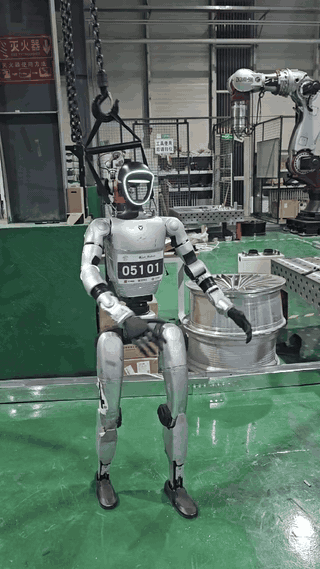

# 🦾 Humanoid Motion Learning

A video-driven humanoid motion-learning pipeline for **human motion recovery, motion retargeting, reinforcement-learning-based tracking, cross-simulation validation, and real-robot deployment preparation** using the Unitree G1 humanoid robot.

This project was developed as part of a broader research effort on reinforcement-learning platforms for humanoid robots operating in confined-space welding environments.

> 📌 **Project status:** The motion-learning pipeline has been established and validated in simulation.  
> Real-robot deployment is currently at the preliminary integration and safety-validation stage.
>
> **Release status:** This repository is a research portfolio and technical overview. Selected visual results are included; the complete training stack is not redistributed here.

---

## 🔍 Overview

Whole-body motion learning for humanoid robots requires more than directly training a control policy.

Human motion obtained from ordinary video must first be reconstructed, converted into a robot-compatible representation, retargeted to the target humanoid morphology, and organized into trajectories suitable for tracking-policy training.

This project develops a staged workflow from monocular video input to simulation training, cross-simulation validation, motion refinement, and preparation for deployment on a physical Unitree G1 platform.

---

## 🧠 System Pipeline

<p align="center">
  
</p>

<p align="center">
  <i>Video-driven humanoid motion pipeline from human motion recovery to policy training, cross-simulation validation, motion refinement, and real-robot deployment preparation.</i>
</p>

The overall workflow is:

```text
Monocular Video
      ↓
Human Motion Recovery
      ↓
Motion Retargeting
      ↓
Motion Data Conversion
      ↓
Tracking Policy Training
      ↓
Isaac Lab Validation
      ↓
Cross-Simulation Validation
      ↓
Motion Refinement
      ↓
Real-Robot Deployment Preparation
```

---

## 🎥 Video-Driven Human Motion Recovery

Ordinary monocular video is used as the motion source.

The project uses **GVHMR** to recover structured whole-body human motion from video. The recovered motion sequence is then prepared for later retargeting and policy training.

This provides a practical way to obtain motion demonstrations without requiring a dedicated motion-capture system.

<p align="center">
  
</p>

<p align="center">
  <i>Example of video-driven full-body motion recovery used as the front end of the humanoid motion-learning pipeline.</i>
</p>

---

## 🔁 Motion Retargeting

Recovered human motion cannot be directly executed by a humanoid robot because the human body and the robot differ in:

- joint structure
- link proportions
- coordinate conventions
- kinematic limits
- motion constraints

The project uses **GMR** to retarget reconstructed human motion to the Unitree G1 humanoid robot.

The retargeted motion is then converted and organized into a form suitable for downstream tracking-policy training.

---

## 🧩 Motion Data Conversion

The output of motion recovery and retargeting requires additional preprocessing before it can be used by the training pipeline.

The processing workflow includes:

- motion-sequence organization
- coordinate transformation
- robot-specific format conversion
- trajectory preprocessing
- training-input preparation

This stage connects human motion reconstruction with the motion representation expected by the target humanoid model.

---

## 🤖 G1 Tracking Policy Training

The processed motion sequences are used to train a whole-body tracking policy for the **Unitree G1 humanoid robot**.

Training is performed using **Isaac Lab** and the `whole_body_tracking` workflow.

The policy is designed to reproduce reference motions while maintaining stable whole-body behavior.

The training process focuses on:

- body-position tracking
- joint-position tracking
- pose consistency
- whole-body coordination
- motion continuity
- episode stability

The resulting policy provides a general motion-control foundation for later task-specific humanoid research.

---

## 🔄 Cross-Simulation Validation

After training, the tracking policy is transferred to **RoboJuDo** for cross-simulation validation.

The goal is to examine whether the learned behavior can remain executable outside the original training environment.

<p align="center">
  
</p>

<p align="center">
  <i>Cross-simulation execution of the G1 tracking policy in RoboJuDo.</i>
</p>

The validation workflow is:

```text
Motion Reference
      ↓
Isaac Lab Policy Training
      ↓
Trained Tracking Policy
      ↓
RoboJuDo Deployment
      ↓
Cross-Simulation Motion Validation
```

This stage serves as an intermediate step between simulation-based training and eventual physical-robot deployment.

---

## 🛠 Motion Refinement

Automatically recovered and retargeted motion may contain:

- unnatural local poses
- motion discontinuities
- joint-pose deviations
- artifacts introduced during motion reconstruction or retargeting

To address these issues, the project also investigates **Blender-based motion refinement**.

<p align="center">
  
</p>

<p align="center">
  <i>Blender-based motion refinement and motion-data re-export workflow.</i>
</p>

The refinement pipeline is:

```text
Motion Sequence
      ↓
Blender Import
      ↓
Pose / Motion Editing
      ↓
Motion Re-export
      ↓
Retraining
```

This provides a practical correction loop for improving problematic motion demonstrations before reuse in policy training.

---

## 🦿 Real-Robot Deployment Preparation

The project also progressed from simulation toward preliminary deployment on a physical Unitree platform.

The deployment workflow includes:

- establishing remote communication with the robot
- transferring the trained policy model
- configuring robot-side execution files
- preparing the policy for real-device inference
- testing the deployment workflow under controlled conditions

The trained policy was exported for deployment, and the communication and execution pipeline with the physical platform was established.

### 🎥 Preliminary Hardware Demo

<p align="center">
  
</p>

<p align="center">
  <i>Preliminary on-device motion demonstration of the Unitree G1 during real-robot deployment preparation.</i>
</p>

▶️ [View the full MP4 demonstration](assets/videos/g1_tracking_demo.mp4)

*Preliminary on-device motion demonstration during real-robot deployment preparation.*

At the current stage, this work should be considered **deployment preparation rather than completed real-robot policy validation**.

Motion stability, configuration consistency, and execution safety require further validation before full autonomous execution.

---

## 🔗 Connection to Confined-Space Welding

This humanoid motion pipeline was developed as a foundation for future humanoid welding research.

Confined-space welding may require coordination between:

- whole-body posture
- upper-limb motion
- welding-tool pose
- obstacle avoidance
- workspace constraints
- task stability

Instead of immediately training a complete welding policy, this project first establishes the motion-learning and deployment infrastructure required for high-degree-of-freedom humanoid control.

Future task-specific work can extend this framework by incorporating welding-related states, actions, rewards, and safety constraints.

---

## 🧰 Technologies

### Humanoid Robotics

- Unitree G1
- whole-body motion tracking
- motion retargeting
- humanoid policy learning

### Reinforcement Learning & Simulation

- NVIDIA Isaac Lab
- RoboJuDo
- reinforcement-learning-based motion tracking
- sim-to-sim policy validation

### Human Motion Processing

- GVHMR
- GMR
- monocular motion recovery
- motion-sequence conversion

### Motion Editing & Deployment

- Blender
- ONNX
- Linux
- SSH-based deployment workflow

### Programming

- Python

---

## 👩‍💻 Project Role

This work was completed as part of a team Keystone project on reinforcement-learning platforms for confined-space humanoid welding robots.

I served as the **group leader** and participated in the development, integration, testing, and organization of the staged technical pipeline.

The project was completed collaboratively, with contributions across:

- motion processing
- simulation deployment
- tracking-policy training
- data conversion
- experimental validation
- platform integration

---

## 🚧 Current Scope

This repository focuses specifically on the **humanoid motion-learning pipeline**.

Completed stages include:

- video-based human motion recovery
- humanoid motion retargeting
- motion-data preprocessing
- G1 tracking-policy training
- simulation-based policy validation
- cross-simulation verification
- Blender-based motion refinement
- preliminary real-device deployment preparation

Future work includes:

- task-specific welding reinforcement learning
- full humanoid welding policy design
- systematic sim-to-real policy transfer
- stable real-robot motion validation
- autonomous welding execution
- safety-aware task-level policy evaluation

---

## 📁 Repository Structure

```text
humanoid-motion-learning/
│
├── assets/
│   ├── images/
│   │   ├── Blender motion refinement.png
│   │   ├── RoboJuDo cross-simulation.png
│   │   ├── humanoid motion pipeline.png
│   │   └── video-driven full-body motion recovery.png
│   │
│   └── videos/
│       └── g1_tracking_demo.mp4
│
├── README.md
└── .gitignore
```

Selected visual materials and demonstrations are included here for research-portfolio purposes.

Some components of the full workflow depend on external research repositories and simulation frameworks and are therefore not redistributed directly in this repository.

---

## 📄 Project

**Reinforcement Learning Platform for Confined-Space Humanoid Welding Robots**

Keystone Project  
Fan Gongxiu Honors College  
Beijing University of Technology

---

## 🔗 Related Projects

This humanoid motion-learning pipeline is part of a broader robotics research workflow.

- [🤖 **Task-Registered Robotic Welding Framework**](https://github.com/wwryy/robotic-welding-platform) — sim-to-real perception, RGB-D geometry recovery, weld-path generation, and robot interfaces
- [🎮 **Tetris Closed-Loop Control**](https://github.com/wwryy/tetris-closed-loop-control) — foundational perception–decision–execution verification platform

The original project materials and media remain all rights reserved unless otherwise noted.

---

## 📬 Contact

**Weiran Wang**  
Beijing University of Technology  
Mechanical Engineering  
Second Bachelor's Degree in Computer Science and Technology
